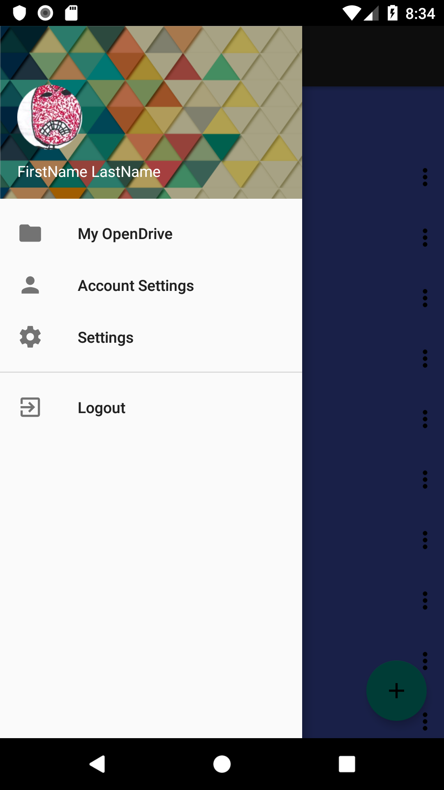
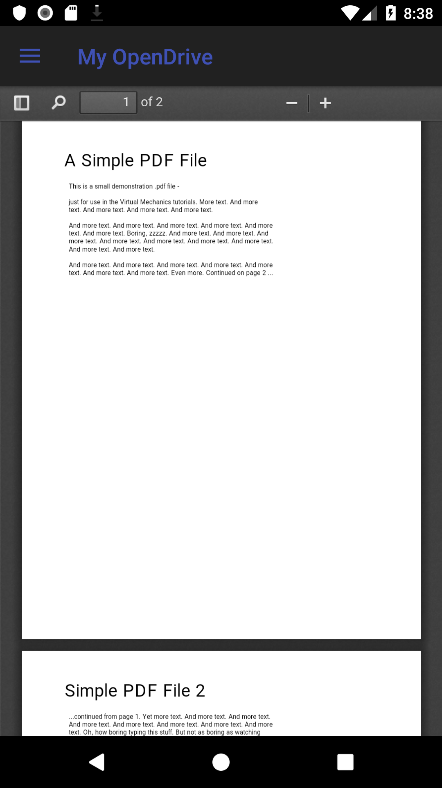
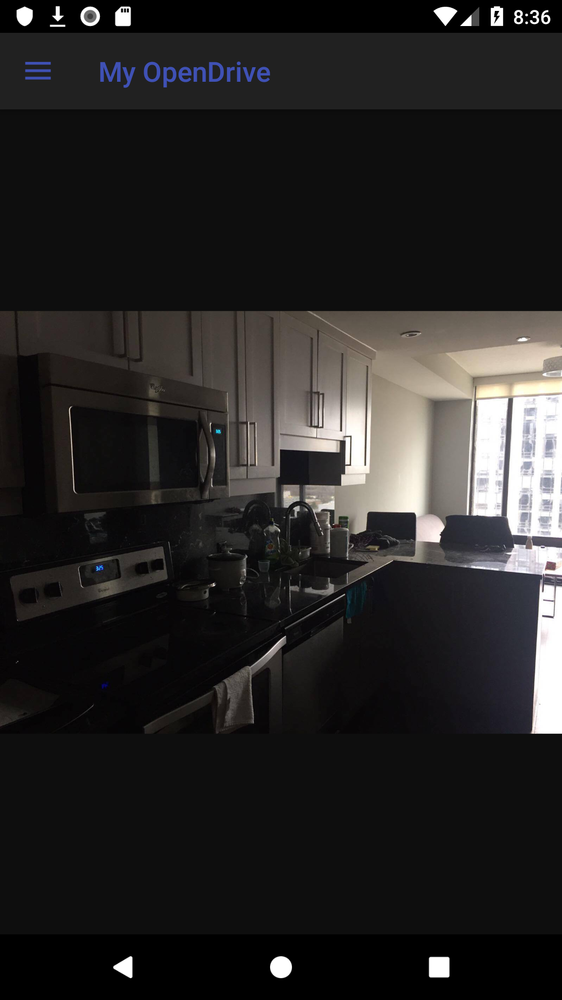
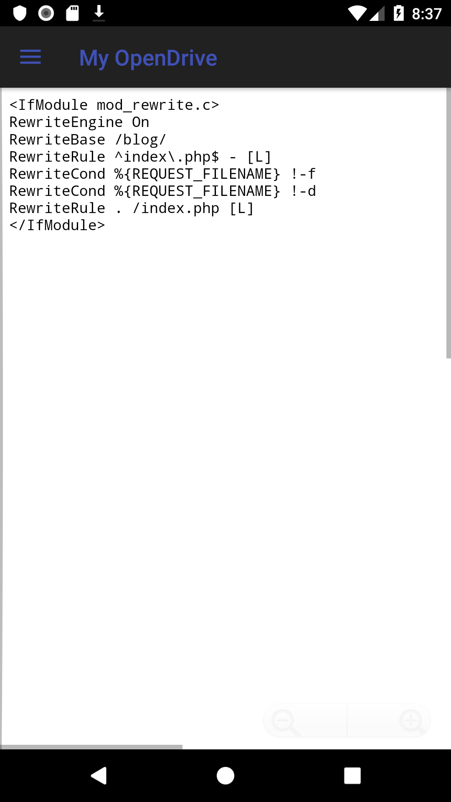

# BetterOpenDrive
BetterOpenDrive is a client application utilising OpenDrive's public APIs. This application was born out of pure frustration gained from directly using OpenDrive's official app. I found that many of the features that it had were not done well and many of the futures that I wanted did not exist in the app. After discovering the existence of public APIs and available documention this led me to make my own.

WARNING: This application is not yet completed and as such the UI/UX aspects have not been worked on (current UI is place holder until functionality is ready).

    Folder Browser View
	

    Folder Menu
	

    Preview PDF Files
    

	Preview Image Files
    

    Preview Text Files
	

## TODO:

* Options menu: Added options. TODO: Implementation 
* Uploading Files - In Progress
* Deleting Folders/Files (From Trash)
* Bulk Downloading
* Account Settings - View Created
* Regular settings - View Created
* Camera Uploads
* Resetting Password
* Login Dialog
* Loading Screen Before Login Dialog
* Add Missing Views
* Unit Tests

## Maybe TODO:

* Secure Folders
* Notes
* Tasks(?)
* User Management
